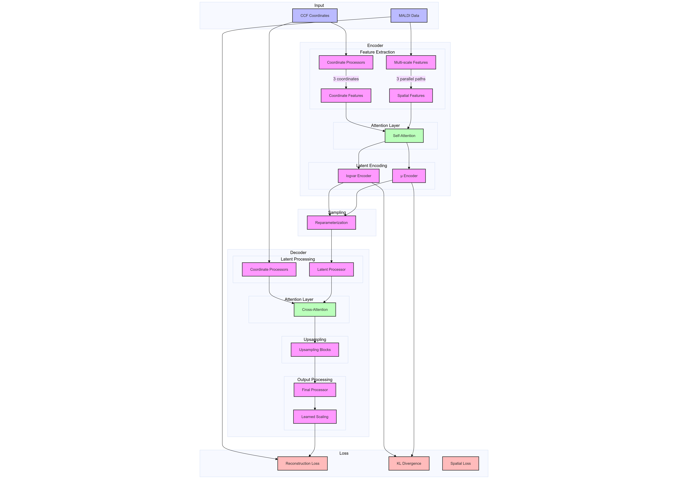

# Conditional VAE for Brain Lipid Spatial Distribution Enhancement

This repository implements a conditional Variational Autoencoder (CVAE) designed specifically for enhancing brain lipid spatial distribution data. The model combines advanced deep learning techniques including multi-scale processing, attention mechanisms, and coordinate-based conditioning to achieve high-quality spatial reconstructions.

## Architecture Overview

The CVAE architecture consists of three main components working together to process and enhance spatial distribution data:

## Key Features

### 1. Encoder Architecture
- Multi-scale feature extraction with parallel processing paths
- Enhanced spatial processing through self-attention mechanisms
- Coordinate-aware encoding with dedicated processors
- Uncertainty estimation in latent space

### 2. Decoder Design
- Progressive upsampling with residual connections
- Cross-attention for feature fusion
- Coordinate conditioning for spatial awareness
- Learnable output scaling for better adaptation

### 3. Loss Functions
- Cyclical Kullback-Leibler annealing for improved latent space organisation
- Bounded reconstruction loss with penalties
- L1 regularisation on latent space

### 4. Training Optimisations
- Mixed precision training support
- Progressive learning schedules
- Customisable learning rate scheduling
- Checkpoint management for best model selection

## Mathematical Formulation

The model is based on the following key equations:

1. **Encoder (Recognition Model)**:

   $q(z|x,c) = \mathcal{N}(\mu(x,c), \sigma^2(x,c))$

   where $\mu$ and $\text{log}\sigma^2$ are produced by the encoder network

2. **Decoder (Generation Model)**:

   $p(x|z,c) = \mathcal{N}(f(z,c), I)$

   where $f$ is the decoder network

3. **Loss Function**:

   $\mathcal{L} = \mathcal{L}_{\text{recon}} + \beta(t)\mathcal{L}_{\text{KL}} + \mathcal{L}_{\text{reg}}$

   where:
   - Reconstruction Loss: $\mathcal{L}_{\text{recon}} = \text{MSE}(x, \hat{x}) + \lambda\text{bounds\_penalty}$
   - KL Divergence: $\mathcal{L}_{\text{KL}} = -\frac{1}{2}\sum(1 + \text{log}\sigma^2 - \mu^2 - \sigma^2)$
   - Cyclical annealing: $\beta(t) = \beta_{\text{min}} + (\beta_{\text{max}} - \beta_{\text{min}})\cdot\frac{1}{2}(1 + \sin(\pi(\frac{t}{T} - 0.5)))$
   - Regularization includes L1 and spatial consistency terms

4. **Spatial Consistency Loss**:

   $\mathcal{L}_{\text{spatial}} = \sum_{i,j} w_{ij} \|\hat{x}_i - \hat{x}_j\|$

   where $w_{ij} = \frac{1}{d(c_i, c_j) + \epsilon}$ and $d(c_i, c_j)$ is the distance between coordinates

## Structure

- `cvae.py`: Main CVAE model implementation
- `encoder.py`: Enhanced encoder with multi-scale processing
- `decoder.py`: Decoder with upsampling
- `losses.py`: Advanced loss functions and regularisation

## Model Components

### Enhanced Encoder
- Multi-scale feature extraction through parallel pathways
- Coordinate processing with dedicated attention mechanisms
- Uncertainty estimation in latent space
- Advanced residual blocks with dual-path architecture

### Sophisticated Decoder
- Progressive upsampling with skip connections
- Cross-attention for feature fusion
- Coordinate-aware reconstruction
- Learnable output scaling

### Loss Functions
- ImprovedVAELoss with cyclical KL annealing
- ProgressiveKLVAELoss for gradual constraint introduction
- Spatial consistency loss function

## License

This code is part of the mlibra project collaboration between the Swiss Data Science Center and EPFL. Academic/Research usage license applies. See LICENSE file in the root directory for details.

## Contributing

Contributions to this project are welcome. Please ensure that any pull requests:
1. Maintain code quality and style
2. Include appropriate tests
3. Update documentation as needed
4. Follow the existing architecture patterns